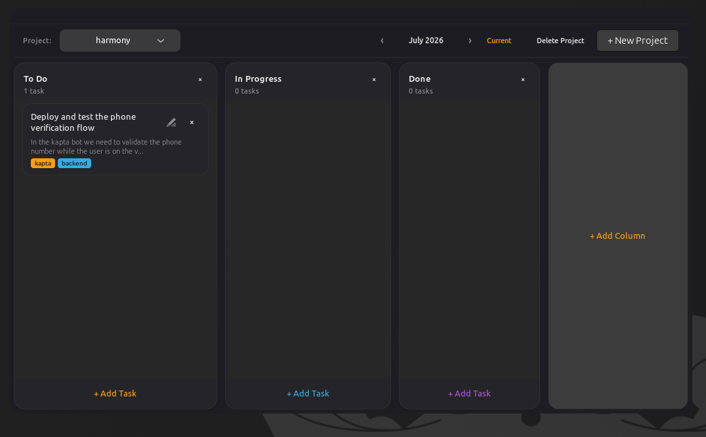

# Ctrl Project Management



A dark-themed GTK4 kanban board for managing projects and tasks, with a built-in MCP (Model Context Protocol) server for AI agent integration.

## Features

- **Kanban board** — drag-and-drop tasks across columns
- **Project management** — create, switch, and organize multiple projects
- **Month filtering** — view tasks by month with easy navigation
- **AI agent access** — built-in MCP server lets AI tools (opencode, Claude Desktop, etc.) read and modify your board

## Usage

### GUI

```bash
ctrl-project-management
```

### MCP server (for AI agents)

```bash
ctrl-project-management mcp
```

Test it:

```bash
echo '{"jsonrpc":"2.0","id":1,"method":"tools/list"}' | ctrl-project-management mcp
```

## Install

### From release

```bash
# tar.gz
tar xzf ctrl-project-management-v0.1.0-linux-x86_64.tar.gz
./install.sh              # user install (~/.local/bin)
sudo ./install.sh --system  # system-wide (/usr/local/bin)

# deb
sudo dpkg -i ctrl-project-management_0.1.0_amd64.deb
```

### From source

```bash
sudo apt install libgtk-4-dev
cargo build --release
./scripts/install.sh
```

## Build release

```bash
./scripts/release.sh 0.1.0
```

Produces `.tar.gz` and `.deb` in the project root.

## Agent configuration

Register with opencode or Claude Desktop:

```json
{
  "mcpServers": {
    "kanban": {
      "command": "ctrl-project-management",
      "args": ["mcp"]
    }
  }
}
```
